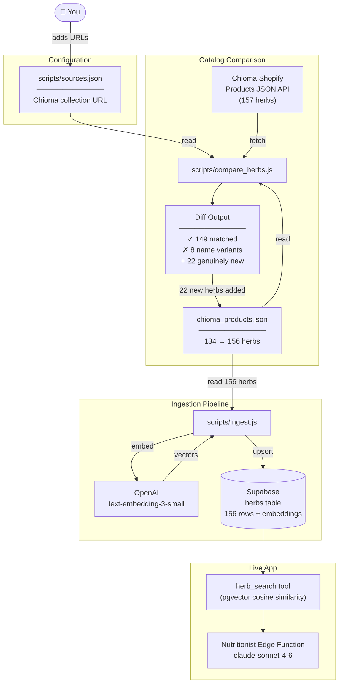

# Herb Catalog Pipeline

Diagram of the catalog comparison and ingestion pipeline added in the herb expansion update.

```mermaid
flowchart TD
    User(["👤 You"])

    subgraph Config["Configuration"]
        sources["scripts/sources.json\n─────────────\nChioma collection URL"]
    end

    subgraph Comparison["Catalog Comparison"]
        compare["scripts/compare_herbs.js"]
        shopify["Chioma Shopify\nProducts JSON API\n(157 herbs)"]
        products["chioma_products.json\n─────────────\n134 → 156 herbs"]
        diff["Diff Output\n─────────────\n✓ 149 matched\n✗ 8 name variants\n+ 22 genuinely new"]
    end

    subgraph Ingestion["Ingestion Pipeline"]
        ingest["scripts/ingest.js"]
        openai["OpenAI\ntext-embedding-3-small"]
        supabase[("Supabase\nherbs table\n156 rows + embeddings")]
    end

    subgraph App["Live App"]
        nutritionist["Nutritionist Edge Function\nclaude-sonnet-4-6"]
        herb_search["herb_search tool\n(pgvector cosine similarity)"]
    end

    User -->|"adds URLs"| sources
    sources -->|"read"| compare
    shopify -->|"fetch"| compare
    products -->|"read"| compare
    compare --> diff
    diff -->|"22 new herbs added"| products
    products -->|"read 156 herbs"| ingest
    ingest -->|"embed"| openai
    openai -->|"vectors"| ingest
    ingest -->|"upsert"| supabase
    supabase --> herb_search
    herb_search --> nutritionist
```
