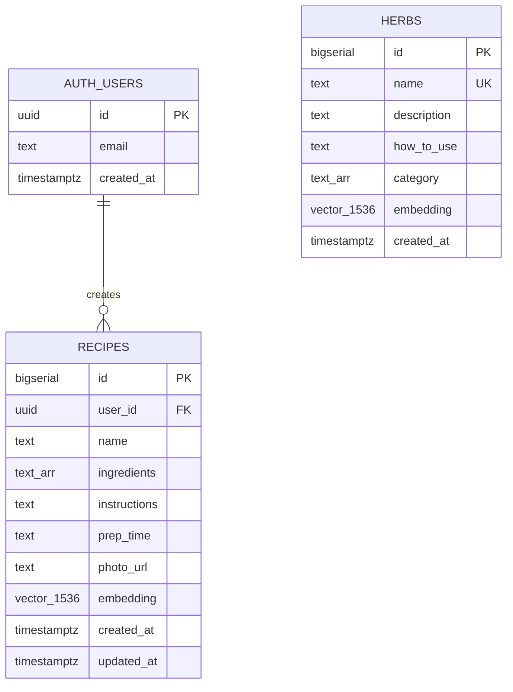

# Mobile App + Community Recipes

## Overview

Add an Expo React Native mobile app (`/mobile`) and a community recipes feature to Apothecary. Users can search herbs (existing), browse and search community recipes (new), and upload their own recipes with photos. The recipe feature is available on both mobile and web. Auth is required for uploads; browsing and searching is open to everyone.

## Problem Statement / Motivation

Apothecary currently only works on the web and only surfaces herb data. Users want to share and discover herbal recipes — teas, tinctures, blends — using the same semantic search experience. A mobile app makes this accessible on the go.

## Proposed Solution

### Architecture

```
┌─────────────┐  ┌─────────────┐
│   /mobile   │  │   /client   │
│  Expo (RN)  │  │  React SPA  │
└──────┬──────┘  └──────┬──────┘
       │                │
       └───────┬────────┘
               │  Supabase JS SDK
       ┌───────┴────────┐
       │  Edge Functions │
       │  /search        │  ← updated: returns herbs + recipes
       │  /recipes       │  ← new: CRUD + embedding
       └───────┬────────┘
               │
       ┌───────┴────────┐
       │   Supabase DB   │
       │  herbs (pgvector)│
       │  recipes (pgvector)│
       │  auth.users      │
       │  Storage (photos)│
       └─────────────────┘
```

### Key Design Decisions

| Decision | Choice | Rationale |
|----------|--------|-----------|
| Search UX | Single search bar, tabbed results (Herbs \| Recipes) | Unified experience, two parallel RPC calls |
| Recipe embedding | Embed `"<name>: <ingredients>"` only | Matches herb strategy — procedural text dilutes semantic signal |
| Embedding generation | New `recipes` Edge Function generates embedding on create/update | Keeps OpenAI key server-side, centralizes logic |
| Photo storage | Supabase Storage, public bucket `recipe-photos` | Simple URL access, no signed URLs needed |
| Photo constraints | Max 5MB, JPEG/PNG/WebP, client compresses to 1200px max width | Mobile-friendly, prevents bloat |
| Photo required? | Optional — show placeholder when missing | Lower friction for recipe uploads |
| Auth provider | Supabase Auth (email/password) | Already integrated, works on web + mobile |
| Auth session (mobile) | `expo-secure-store` for token persistence | Secure storage on device |
| Recipe ownership | RLS: author can edit/delete their own recipes | Enforced at database level, not application |
| Recipe names | Unique per user, not globally | Two users can have "Chamomile Sleep Tea" |
| Code sharing | No shared packages initially — duplicate API/hook layers | Avoids monorepo tooling complexity; extract later if patterns stabilize |
| Navigation (mobile) | Bottom tab navigator: Search, Add Recipe, Profile | Standard mobile pattern |
| Web routing | Add React Router: `/`, `/recipe/:id`, `/login`, `/signup`, `/my-recipes` | Currently no router; needed for recipe detail + auth pages |

---

## Technical Approach

### Database Schema

#### `recipes` table

```sql
CREATE TABLE recipes (
  id BIGSERIAL PRIMARY KEY,
  user_id UUID NOT NULL REFERENCES auth.users(id) ON DELETE CASCADE,
  name TEXT NOT NULL,
  ingredients TEXT[] NOT NULL,
  instructions TEXT NOT NULL,
  prep_time TEXT,                        -- free text e.g. "20-30 min"
  photo_url TEXT,                        -- Supabase Storage public URL, nullable
  embedding VECTOR(1536) NOT NULL,
  created_at TIMESTAMPTZ DEFAULT NOW(),
  updated_at TIMESTAMPTZ DEFAULT NOW(),
  UNIQUE(user_id, name)                  -- unique per user
);
```

#### `match_recipes` RPC

```sql
CREATE OR REPLACE FUNCTION match_recipes(
  query_embedding VECTOR(1536),
  match_threshold FLOAT DEFAULT 0.3,
  match_count INT DEFAULT 10
)
RETURNS TABLE (
  id BIGINT,
  user_id UUID,
  name TEXT,
  ingredients TEXT[],
  instructions TEXT,
  prep_time TEXT,
  photo_url TEXT,
  similarity FLOAT
)
LANGUAGE plpgsql STABLE
AS $$
BEGIN
  RETURN QUERY
  SELECT
    r.id, r.user_id, r.name, r.ingredients, r.instructions,
    r.prep_time, r.photo_url,
    1 - (r.embedding <=> query_embedding) AS similarity
  FROM recipes r
  WHERE 1 - (r.embedding <=> query_embedding) > match_threshold
  ORDER BY r.embedding <=> query_embedding
  LIMIT match_count;
END;
$$;
```

#### Index

```sql
CREATE INDEX ON recipes USING ivfflat (embedding vector_cosine_ops) WITH (lists = 10);
```

#### RLS Policies

```sql
-- Recipes: anyone can read, authenticated users can insert, authors can update/delete
ALTER TABLE recipes ENABLE ROW LEVEL SECURITY;

CREATE POLICY "Anyone can view recipes"
  ON recipes FOR SELECT
  USING (true);

CREATE POLICY "Authenticated users can insert recipes"
  ON recipes FOR INSERT
  WITH CHECK (auth.uid() = user_id);

CREATE POLICY "Authors can update own recipes"
  ON recipes FOR UPDATE
  USING (auth.uid() = user_id);

CREATE POLICY "Authors can delete own recipes"
  ON recipes FOR DELETE
  USING (auth.uid() = user_id);

-- Also secure the existing herbs table (currently unprotected)
ALTER TABLE herbs ENABLE ROW LEVEL SECURITY;

CREATE POLICY "Anyone can view herbs"
  ON herbs FOR SELECT
  USING (true);
```

#### Supabase Storage

```sql
-- Create public bucket for recipe photos
INSERT INTO storage.buckets (id, name, public) VALUES ('recipe-photos', 'recipe-photos', true);

-- Storage policies
CREATE POLICY "Anyone can view recipe photos"
  ON storage.objects FOR SELECT
  USING (bucket_id = 'recipe-photos');

CREATE POLICY "Authenticated users can upload recipe photos"
  ON storage.objects FOR INSERT
  WITH CHECK (bucket_id = 'recipe-photos' AND auth.role() = 'authenticated');

CREATE POLICY "Users can delete own recipe photos"
  ON storage.objects FOR DELETE
  USING (bucket_id = 'recipe-photos' AND auth.uid()::text = (storage.foldername(name))[1]);
```

Photo path convention: `{user_id}/{uuid}.{ext}`

---

### ERD



---

### Implementation Phases

#### Phase 1: Database & Backend (Foundation)

Set up the recipes table, RLS, storage, and Edge Functions.

**Tasks:**

- [ ] Create Supabase migration: `recipes` table, `match_recipes` RPC, ivfflat index
- [ ] Add RLS policies for `recipes` table
- [ ] Add RLS policies for `herbs` table (currently unprotected)
- [ ] Create Supabase Storage bucket `recipe-photos` with policies
- [ ] Create Edge Function `supabase/functions/recipes/index.ts`:
  - `POST /` — create recipe (accept JSON body + generate embedding via OpenAI)
  - `PUT /:id` — update recipe (regenerate embedding if name/ingredients change)
  - `DELETE /:id` — delete recipe + associated photo from Storage
- [ ] Update Edge Function `supabase/functions/search/index.ts`:
  - Add parallel call to `match_recipes` RPC
  - Return `{ herbs: [...], recipes: [...] }` (breaking change to response shape)

**Files to create/modify:**
- `supabase/migrations/YYYYMMDD_create_recipes.sql` (new)
- `supabase/functions/recipes/index.ts` (new)
- `supabase/functions/recipes/deno.json` (new)
- `supabase/functions/search/index.ts` (modify — add recipe search)

**Success criteria:**
- Recipes can be created, read, updated, deleted via Edge Functions
- Recipe search returns semantically relevant results
- RLS prevents unauthorized mutations
- Photo upload/delete works via Storage

#### Phase 2: Mobile App Scaffold (Expo)

Initialize the Expo project and set up navigation, auth, and the Supabase client.

**Tasks:**

- [ ] Initialize Expo project in `/mobile` (`npx create-expo-app`)
- [ ] Install dependencies: `@supabase/supabase-js`, `expo-secure-store`, `expo-router`, `expo-image-picker`, `expo-image`
- [ ] Set up Supabase client with `expo-secure-store` for auth token persistence
- [ ] Set up `expo-router` with bottom tab navigation:
  - **Search** tab (home) — herb + recipe search
  - **Add Recipe** tab — auth-gated recipe upload form
  - **Profile** tab — auth-gated, shows user's recipes, login/signup/logout
- [ ] Build auth screens: Login, Sign Up, Forgot Password
- [ ] Configure deep linking for auth redirects (email confirmation, password reset)
- [ ] Set up environment variables via Expo config

**Files to create:**
- `mobile/app/_layout.tsx` — root layout with tab navigator
- `mobile/app/(tabs)/search.tsx` — search screen
- `mobile/app/(tabs)/add-recipe.tsx` — recipe upload form
- `mobile/app/(tabs)/profile.tsx` — user profile / my recipes
- `mobile/app/login.tsx` — login screen
- `mobile/app/signup.tsx` — signup screen
- `mobile/app/recipe/[id].tsx` — recipe detail screen
- `mobile/src/api/supabaseClient.ts` — Supabase client with secure storage
- `mobile/src/api/search.ts` — search API calls
- `mobile/src/api/recipes.ts` — recipe CRUD API calls
- `mobile/src/hooks/useSearch.ts` — search state management
- `mobile/src/hooks/useAuth.ts` — auth state management

**Success criteria:**
- App runs on iOS and Android simulators
- Auth flow works (signup, login, logout, password reset)
- Navigation between all screens works
- Supabase client is properly configured with secure token storage

#### Phase 3: Mobile Features (Search + Recipes)

Build the core search and recipe features on mobile.

**Tasks:**

- [ ] Build search screen: search bar, tabbed results (Herbs | Recipes), result cards
- [ ] Build herb card component (name, description, category tags)
- [ ] Build recipe card component (name, photo thumbnail, prep time, ingredient count)
- [ ] Build recipe detail screen (full recipe with photo, ingredients list, instructions, author)
- [ ] Build recipe upload form:
  - Fields: name, ingredients (add/remove), instructions, prep time
  - Photo picker via `expo-image-picker` with compression
  - Submit: upload photo to Storage → call `recipes` Edge Function
- [ ] Build "My Recipes" list on profile screen with edit/delete actions
- [ ] Use `FlashList` for search result and recipe lists (performance)
- [ ] Add loading states, empty states, error handling

**Success criteria:**
- Semantic search returns relevant herbs and recipes
- Recipe upload with photo works end-to-end
- Users can edit and delete their own recipes
- Lists scroll smoothly with many items

#### Phase 4: Web Client Updates

Add recipe features and auth to the existing React SPA.

**Tasks:**

- [ ] Add `react-router-dom` for client-side routing
- [ ] Add routes: `/` (search), `/recipe/:id`, `/login`, `/signup`, `/my-recipes`
- [ ] Update `client/src/api/supabaseClient.js` — no changes needed (browser handles session)
- [ ] Create `client/src/api/recipes.js` — recipe CRUD via Edge Function
- [ ] Create `client/src/hooks/useAuth.js` — auth state management
- [ ] Update search UI: add tabs for Herbs | Recipes results
- [ ] Update `client/src/api/search.js` to handle new response shape `{ herbs, recipes }`
- [ ] Update `client/src/hooks/useSearch.js` to manage both result sets
- [ ] Build auth components: `LoginForm.jsx`, `SignupForm.jsx` + co-located CSS
- [ ] Build recipe components: `RecipeCard.jsx`, `RecipeDetail.jsx`, `RecipeForm.jsx`, `MyRecipes.jsx` + co-located CSS
- [ ] Add nav bar / header with auth status and navigation links

**Files to create/modify:**
- `client/src/App.jsx` (modify — add router)
- `client/src/api/recipes.js` (new)
- `client/src/hooks/useAuth.js` (new)
- `client/src/hooks/useSearch.js` (modify)
- `client/src/api/search.js` (modify)
- `client/src/components/RecipeCard.jsx` + `.css` (new)
- `client/src/components/RecipeDetail.jsx` + `.css` (new)
- `client/src/components/RecipeForm.jsx` + `.css` (new)
- `client/src/components/MyRecipes.jsx` + `.css` (new)
- `client/src/components/LoginForm.jsx` + `.css` (new)
- `client/src/components/SignupForm.jsx` + `.css` (new)
- `client/src/components/NavBar.jsx` + `.css` (new)

**Success criteria:**
- Existing herb search still works
- Recipe search, detail, upload, edit, delete all work on web
- Auth flow works on web
- Plain CSS, co-located with components per project convention

---

## Acceptance Criteria

### Functional Requirements

- [ ] Users can search herbs and recipes from a single search bar (tabbed results)
- [ ] Recipe search uses semantic similarity (same quality as herb search)
- [ ] Anonymous users can browse and search both herbs and recipes
- [ ] Users can sign up with email/password
- [ ] Authenticated users can create recipes with name, ingredients, instructions, prep time, and optional photo
- [ ] Recipes publish immediately upon submission
- [ ] Recipe authors can edit and delete their own recipes
- [ ] Editing a recipe regenerates its embedding
- [ ] Photos are stored in Supabase Storage and displayed in recipe cards/detail
- [ ] Mobile app works on both iOS and Android
- [ ] Web app has all the same recipe features as mobile

### Non-Functional Requirements

- [ ] RLS enforced on both `herbs` and `recipes` tables
- [ ] OpenAI API key never exposed to clients
- [ ] Photo uploads compressed client-side (max 1200px width, max 5MB)
- [ ] Search results load within 2 seconds on reasonable connections
- [ ] Recipe lists use virtualized rendering on mobile (FlashList)

---

## Dependencies & Prerequisites

- Supabase project must have `pgvector` extension enabled (already enabled for herbs)
- OpenAI API key available as Supabase secret (already configured)
- Supabase Auth enabled on the project
- Supabase Storage enabled on the project
- Expo CLI installed locally (`npx expo`)

## Risk Analysis & Mitigation

| Risk | Impact | Mitigation |
|------|--------|------------|
| Breaking change to search response shape | Web app stops working during transition | Deploy backend + web client updates together |
| Spam recipe uploads | Pollutes search results | Add rate limiting in Edge Function (e.g., 10 recipes/user/day); revisit moderation later |
| Large photo uploads on slow mobile networks | Bad UX, timeouts | Client-side compression, progress indicator, retry logic |
| Embedding quality for recipes vs herbs | Mixed search results may confuse users | Test with representative queries; adjust threshold if needed |
| RLS misconfiguration | Data security breach | Test all CRUD operations as anon, authenticated, and wrong-user |

## Documentation Plan

After completing each phase:
- [ ] Update `docs/changelog.md` with milestone summary
- [ ] Update `docs/architecture.md` with new components (recipes table, Edge Functions, mobile app, auth)

## References

### Internal References
- Brainstorm: `docs/brainstorms/2026-03-31-mobile-app-brainstorm.md`
- Edge Function pattern: `supabase/functions/search/index.ts`
- Supabase client pattern: `client/src/api/supabaseClient.js`
- Hook pattern: `client/src/hooks/useSearch.js`
- Component pattern: `client/src/components/HerbCard.jsx`
- Schema reference: `project_spec.md` (lines 125-172)
- Ingestion pattern: `scripts/ingest.js`

### Skills References
- React Native best practices: `.agents/skills/vercel-react-native-skills/SKILL.md`
- Supabase/Postgres best practices: `.agents/skills/supabase-postgres-best-practices/SKILL.md`
